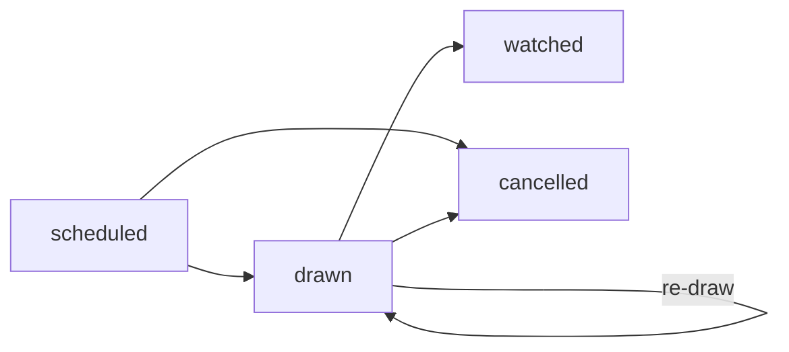
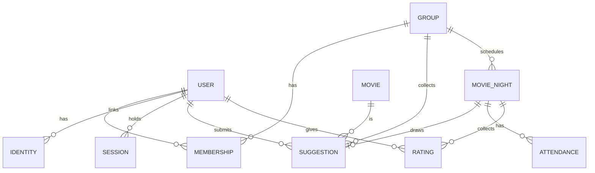

# PRD — filmnacht (Open Source)

2026-09-20, revised 2026-09-21 · @Someone

## 1. Overview

A self-hosted web app where a group of friends collects movie suggestions, draws the film for a given date through a weighted random pick, and rates it together afterwards.

**Problem.** At recurring movie nights the loudest voices decide. The debate eats time, some suggestions never get picked, and the range of genres narrows.

**Product principle.** Chance decides, not volume. Whoever did not get to pick the film gets to rate it afterwards — that is the playful compensation and the source of long-term engagement.

**Scope.** Working title `filmnacht`. Open source under the MIT license, self-hosted, for private groups of 3–12 people. No monetization, no public user directory, no multi-tenant SaaS. Target installation: one `docker-compose.yml`, one `.env`, done.

## 2. Goals and non-goals

**Goals**

1. Over time every member gets their suggestion picked roughly equally often — demonstrably, not just by feel.
2. Deciding on a film takes under a minute instead of half an hour.
3. After the movie night a shared memory emerges with no extra effort: what did we watch, and what did we think of it?
4. A non-technical person can set up an instance in under 15 minutes.

**Non-goals (v1)**

- No streaming and no availability check against Netflix, Prime or Disney+ (a backlog wish, but there is no API that may be used freely).
- No recommendation engine and no machine learning. The single exception is the wildcard pick in section 6: when a pool is empty the app asks TMDB for well-rated films in the genres the group already watches. That is a filtered query, not a learned model, and it is named here so the exception is deliberate rather than accidental.
- No chat, messaging or comment feature — the group already has WhatsApp, Signal or Discord for that.
- **No notifications in the MVP.** There is no delivery channel worth its configuration cost on day one: WhatsApp, which is what this group uses, has no incoming webhook at all (section 6). The draw result lives on a page, and the owner shares the link through the channel the group already has. From v1.0 two optional channels exist — an outgoing webhook for groups on Discord, Matrix or ntfy, and SMTP for individual reminders — and an instance with neither configured stays fully functional.
- No public profiles, no social graph beyond the group.
- No native mobile app. Responsive web (PWA-capable) is enough.

## 3. Users and roles

The app deliberately knows only three roles. Any further role would be overhead for a group of eight friends.

| Role | Rights | Typically |
| --- | --- | --- |
| Instance admin | Configure the instance, set the timezone and the OIDC provider, open or close registration, see every group | The person running the server |
| Group owner | Create the group, invite and remove members, schedule movie nights, trigger the draw, reveal the ratings, change group settings | Whoever organizes the movie night |
| Member | Suggest films, withdraw own suggestions (while undrawn), RSVP, rate, use the leaderboard | Everyone else |

The instance admin is not a group role: they can see groups for maintenance but are not automatically a member. A group owner can hand over ownership or appoint a second owner so the group never becomes unmanageable.

## 4. Groups and invitations

A group is the container for everything else: movie pool, dates, ratings, leaderboard. A user can belong to several groups (friends, flatmates, colleagues).

**Creating.** Name, optionally an emoji or avatar. The creator becomes the owner. No description, no categories — one line is enough.

**Inviting.** The owner generates an invite link with a random token. It is valid for 7 days by default and reusable, capped at 12 redemptions — a group is 3–12 people, so the cap never realistically blocks a real invite, but it bounds what a link leaked into the wrong chat can do, since redeeming one creates an account. Whoever opens the link and signs in becomes a member. Deliberately no email delivery: that saves an SMTP configuration, which is the most common source of failure in self-hosting. The owner sends the link through whatever channel the group already uses.

The invite link is not only an invitation, it is the primary way accounts come into existence — see section 9.

**Group settings** (all with sensible defaults so they can be ignored):

| Setting | Default | Purpose |
| --- | --- | --- |
| Max. open suggestions per member | 3 | Stops one person from flooding the pool |
| Draw mode | Fairness-weighted | Alternative: uniformly random |
| Result visible from | Immediately after the draw | Alternative: only on the night itself |
| Night ends after | 3 hours | When the rating window opens; a 201-minute film needs a longer value than a 90-minute one |
| Rating window | 7 days after the night ends | After that no further ratings are accepted |
| Repeat drawn films | Off | A drawn film does not return to the pool |

**Leaving.** A member can leave the group. Their history stays exactly as it is, name included: they were there, the group watched those films with them, and scrubbing the name would only make the shared memory worse. Leaving removes access, not the past.

**Account deletion** is a different matter and a real obligation. When a user deletes their account, their ratings and suggestions are reassigned to a placeholder "former member" and the account itself is removed. This is the only case in which a name disappears from the group's history, and the consequence is shown clearly before the deletion is confirmed (see section 12).

## 5. Movie pool and suggestions

Each group has exactly one running pool. A suggestion almost always belongs to a member — that is the basis for the fairness weighting and for the question of who landed us with this film. The one exception is the wildcard pick of section 6, which belongs to nobody.

**Adding a film.** The member types a title, the app searches the TMDB API live and shows matches with poster, year, director and runtime. One click adopts the film along with its `tmdb_id`. Metadata is cached locally so the detail view works without an API key and the instance does not phone out on every page load.

TMDB is free for non-commercial use; the API key is set per instance in `.env`. Without a key a manual mode remains: title, year and optionally a poster URL by hand. The app must be fully usable without a TMDB key, just less pretty. The wildcard pick is the one feature that genuinely requires a key, and it is disabled with a visible reason when none is configured.

**Pool rules**

- Duplicates are rejected without revealing who added the film first. Matching cannot rely on `tmdb_id` alone, because manually entered films have none — otherwise two people add "Dune" by hand and the pool quietly holds both. Every suggestion therefore carries a `dedupe_key`, computed on insert as `tmdb:<id>` where an ID exists and `manual:<slugified-title>:<year>` where it does not, unique per group.
- A suggestion can be withdrawn as long as it has not been drawn.
- Optional free-text field "Why this film?" (max. 200 characters), revealed only after the draw.
- Films already drawn leave the pool (configurable).

**Pool view.** A grid of posters with no indication of who submitted them. Only your own suggestions are marked as yours. Who suggested a film is revealed with the draw, together with the optional note. No voting, no likes, no comments in the pool — that would undermine the whole idea of the random pick.

## 6. Movie nights and the draw

**Scheduling.** The owner (optionally any member, per setting) sets date and time, plus an optional location. Members respond yes, no or maybe. All times are stored in UTC and displayed in the instance timezone, which the instance admin sets once (section 12).

**Lifecycle.** A movie night moves through four states, and the transitions matter more than the states do.

| State | Meaning |
| --- | --- |
| `scheduled` | Date set, members RSVP, pool still open |
| `drawn` | A suggestion has been picked; the pool for this night is closed |
| `watched` | The night happened; the rating window is open |
| `cancelled` | The night did not happen |

**Cancelling and re-drawing both release the film.** The suggestion returns to `open` and goes back into the pool, and — this is the part that is easy to get wrong — it does not count towards anyone's fairness window, because the fairness window counts films *watched*, not films drawn. A night that never happened must not cost a member their turn.

**The draw.** The owner triggers it manually. An automatic draw at a configured moment is a v1.0 feature and is explicitly coupled to a notification channel: a draw that fires at 3am into a page nobody has open is worse than no automatic draw at all.

The draw covers all open suggestions in the group, with three cases to handle:

- **Exactly one open suggestion.** It wins. The app says so plainly rather than pretending to roll dice.
- **No open suggestions.** In the MVP the draw button is disabled and reads "nobody has suggested anything yet". From v1.0 the **wildcard pick** takes over: one `/discover/movie` call against TMDB, filtered to the group's three most-watched genres, with `vote_count.gte` set high enough to keep obscurities out, and a random choice from the top results. The wildcard enters the pool as an ordinary suggestion that belongs to nobody, counts towards no member's fairness window — correctly, since no member spent a turn on it — and appears everywhere in the UI as "🎲 Wildcard".
- **Everything else.** The weighted draw below.

**Fairness weighting.** Pure randomness feels unfair over a small number of rounds. With eight people and a uniform pick, the chance that one particular person goes five movie nights in a row without a turn is 51 percent — and that it happens to *somebody* in the group is close to certain. That feeling is exactly what the app exists to remove. So the default weighting draws people, not films.

Step 1: a person is drawn from all members with at least one open suggestion. A person's weight is `1 / (1 + number of their films watched in the last 10 movie nights)`. The count is of nights actually watched, never merely drawn: a cancelled night or a re-draw must not cost anyone their turn. The rolling window keeps founding members from being penalized for years. A newcomer starts at the maximum weight, the same as a member the draw has skipped for the whole window — as far as the app can tell both have been waiting, and both should go next. Whoever has not had a turn inside the window carries the highest weight; whoever just had one carries the lowest. Nobody ever drops to zero.

Step 2: one of that person's open suggestions is drawn uniformly.

The two-stage approach solves a problem that a naive draw across all films creates: someone who enters ten films would otherwise have ten times the chance of someone with one. The per-member limit from section 4 then becomes a safeguard rather than a necessity.

Goal 1 says "demonstrably, not just by feel", so the weighting is checked by simulation rather than by argument: a test runs 1000 movie nights across 8 members and asserts that the ratio between the busiest and the quietest member's share stays inside a fixed bound.

**Transparency.** Every draw is logged reproducibly: timestamp, the candidate list with weights, and the seed used. The log ships in the MVP even though nothing renders it yet, because log data cannot be backfilled and the first ten nights are the ones you will most want receipts for. The "How did this happen?" view that displays the probabilities follows in v1.0. This is not a gimmick — it is what stops arguments about manipulation before they start. The seed is generated with a cryptographically secure source (`crypto.randomInt`, not `Math.random`).

**Manual override.** The owner may re-run a draw exactly once (for instance if the drawn film is available nowhere), after ticking a confirmation; no reason is asked for. Draws append to the log and never overwrite it, so both the original result and the override survive, and the night shows its film as "Redrawn". Visibility matters more here than prevention.

**How the group finds out.** It does not, automatically — not in the MVP, and not through a webhook either. WhatsApp, which is what this group actually uses, has no incoming-webhook primitive: the Business Cloud API sends templated messages to individuals who opted in, and the libraries that appear to post into group chats drive a reverse-engineered WhatsApp Web session at the risk of the account being banned. So the owner opens the result and shares the link. From v1.0 an outgoing webhook covers groups on Discord, Matrix or ntfy, and SMTP covers the one thing a group webhook structurally cannot do: the individual reminder that your rating window closes tomorrow. Both are optional.

## 7. Ratings and user profile

**Rating window.** It opens when the night ends (start time plus the group's "night ends after" setting, 3 hours by default) and stays open for 7 days. Window state is computed on read by comparing against the current time — there is no job that closes anything, and therefore no scheduler in the MVP.

**Who may rate.** Any member of the group. The earlier design restricted this to attendees, but the only available signal for attendance is an RSVP made days in advance — a promise, not a fact — which then needed an owner-unlock flow to patch the cases it got wrong. That is an eligibility check, a permission rule and a UI flow spent policing eight friends. The social contract already handles it.

**Scale.** 1–10 in half steps, entered via a slider or five stars with half steps. A ten-point scale rather than five stars, because groups of friends tend to want fine distinctions and because it stays comparable to TMDB and IMDb figures. Plus an optional comment (max. 500 characters). Scores are stored as an integer from 2 to 20 (the score doubled) rather than as a float: SQLite has no decimal type, and exact integers keep averages, leaderboard sorting and the spread tiebreak of section 8 deterministic.

**Blind rating and the reveal.** Until the reveal, nobody sees anyone else's rating. The reveal fires when every member who RSVP'd yes has submitted, **or** when the owner taps "reveal now". The owner's finger is the important half: gating the most entertaining moment of the cycle on the least reliable signal in the system means one forgetful person holds the group hostage for a week. After the reveal, late ratings simply append and move the average — no re-freezing, no second reveal.

This prevents anchoring effects and is the most entertaining moment of the whole cycle.

**Per-film figures**

- Group average
- Spread (lowest and highest rating, with names — the outlier of the evening)
- Deviation from the TMDB score, where available

**User profile** (v1.0). Every member has a profile, visible to the group:

| Area | Content |
| --- | --- |
| My suggestions | All films submitted, drawn and open |
| My ratings | Every film rated, with my score, chronologically |
| Hit rate | The group's average score for films I suggested |
| Toughness | My rating average compared to the group average |
| Stats | Number of movie nights, films drawn, favourite genres from TMDB data |

"Hit rate" and "toughness" are the two numbers the group will argue about — which is exactly why they belong prominently in the profile. Wildcard films belong to nobody and are excluded from hit rate.

## 8. Leaderboard

The leaderboard (v2) ranks every film the group has ever watched. **Decided: ranking from ratings alone, from day one** — no separate voting mechanism.

That has a concrete advantage: the leaderboard is populated after the very first movie night and costs nobody an extra interaction. A voting system that stays empty because nobody uses it does more harm than good.

**Sorting and display**

| Column | Content |
| --- | --- |
| Rank | Position by group average |
| Film | Poster, title, year |
| Group avg. | Average of all ratings submitted |
| Spread | Lowest to highest individual rating |
| Suggested by | The member who submitted the film, or "🎲 Wildcard" |
| Watched on | Date of the movie night |

**Ties** are broken by the smaller spread: a film everyone agreed on ranks above one that polarized. If they are still equal, the earlier date wins.

**Filters.** By year, genre and suggester, plus two fixed views that tend to get opened most: "Top 10 of all time" and "Biggest flops".

A duel mode with Elo ratings stays documented as a backlog candidate, see section 13. It would separate "rated highly" from "would pick again" — interesting, but not needed to make the app usable.

## 9. Authentication

For self-hosting, login is not the easy part but the hardest one — not because of the code, but because of its prerequisites. Every OIDC provider means the operator creating their own OAuth app; Google is 10–15 minutes of clicking through a console that changes regularly, Apple requires a paid developer membership and a signed JWT that expires twice a year, and both require a publicly reachable HTTPS redirect URI that a home-network instance does not have. Magic links avoid all of that and introduce SMTP instead, which is the most common thing to be misconfigured in a self-hosted stack.

So the MVP has neither *as its login mechanism*. It has a username and a password, hashed with `scrypt` from Node's standard library — no password-hashing dependency, no native module, nothing for an operator's arm64 box to fail to compile.

**Registration stays closed.** An account is still created only through a valid group invite link. That is a security property worth keeping: a publicly reachable instance cannot be filled with strangers, and it is the reason this app needs no CAPTCHA, no email confirmation and no moderation queue.

**How accounts come into existence.** The invite token from section 4 creates the account on first open. The join form asks for three things: a **username** (unique per instance, the thing you log in with), a **display name** (what the group sees, free to duplicate and free to change), and a **password**. An email address is optional and may be added later. That is the whole registration flow.

**Why a separate username rather than logging in with the display name.** Two friends called Alex should both be able to be "Alex" to the group, and anyone should be able to change what the group calls them without changing how they sign in. Conflating the two makes one of those impossible.

**How a user gets back in.** Username and password, at `/login`. On a second device, the same.

**When they forget the password**, there are two recoveries, and the order matters:

1. **The personal login link** — a 128-bit token at `/login/<token>`. **Revised (decision 21):** revealing a *new* one now requires the current password, so this recovers an account only when the member saved a link **before** they forgot. A link saved in advance still signs them in on any device, still regenerates on reveal, still signs out every other session, and still needs **no mail server at all**.
2. **An emailed reset link**, when the operator has configured SMTP *and* the member has set an address. Short-lived, single-use, and stored hashed like every other token here.
3. **A recovery link generated by the instance admin**, at `/admin`, which needs no mail server at all. It mints exactly the same single-use reset token as path 2 and shows it to the admin once, to be handed over in person or through a channel they trust. It requires the admin's *own* password, for the reason decision 21 gives about the member's: minting a credential for somebody else's account is at least as powerful as revealing your own, so an admin's unlocked laptop must not be a master key.

The three degrade in that order, and the last one always exists. Every instance has an admin, so no member is ever left with nothing — which is the whole point, and why path 3 is not optional polish.

**The gap decision 21 opened, and how it was closed.** Worth keeping on the record, because the shape of the mistake is more useful than a document that reads as though nothing went wrong. Gating reveal narrowed the SMTP-free recovery from "any device still signed in" to "a link saved in advance". A member who forgot their password, saved no link, and was still signed in then had no self-service way back: they could not change the password without the old one, and could not mint a link without it either. Their remaining session slid for 30 days and then the account was unreachable. There was no admin-side reset in the product at the time — no `/admin` route, and `setPassword` and `regenerateLoginToken` had no caller outside `/profile` — so "recovery needs the instance admin" meant the operator editing SQLite by hand. It was recorded here as an open gap rather than treated as solved, and left to the plan that owns recovery. **Path 3 above is that closure**: `/admin` mints the same reset token with no mail server in the picture. The emailed reset alone would not have closed it, because it makes SMTP the prerequisite that the rule below forbids.

**What "revoke" means, precisely.** Only the hash of the login token is stored, so the link cannot be displayed a second time: revealing it *generates a new one* and the previous link stops working. That is the same action as revoking, which is why there is one button and not two. Revoking also **ends every other session that member has** — the device doing the revoking stays signed in, every other one is signed out and must use the new link. This matters because the threat this feature has to answer is a link pasted into the wrong chat: rotating the token alone would kill the link while leaving the session it already granted alive and renewing itself indefinitely. Revoking the credential without revoking the access it bought is not revocation.

The honest trade-off on the login link: it is a bearer token that will end up in browser history and in a chat message. It is now a *recovery* path rather than the whole login system, which is a materially smaller exposure than it was — and revealing a new one signs out every other session, so a leaked link can be shut off from any device still signed in. Anyone who wants real authentication configures OIDC from v2.

**Sessions.** HTTP-only, secure, SameSite=Lax cookies; server-side sessions in the database; 30-day lifetime with sliding expiration. No JWT in local storage. Session tokens are stored **hashed**, so a leaked database is not also a set of live sessions.

**Email.** Optional, per user, nullable. It serves password reset, the draw emails, and the rating emails ("rating is open", "closes tomorrow"); the rating emails can be switched off on the profile. A member who does not set one loses nothing except those emails and that recovery path.

**SMTP is optional per instance.** With none configured, the reset form says so plainly and points at the personal login link. Everything else — joining, logging in, suggesting, drawing, rating — works unchanged.

One rule holds permanently, and it is what keeps section 4's argument honest: **login never depends on SMTP.** Signing in is username and password, which needs no mail server, and a saved personal login link gets a member back in without one. Email is allowed to make recovery nicer; it is never allowed to be the thing standing between a member and their account.

**Where that rule was strained, and how it was repaired.** For one release the rule held only on paper. Decision 21 gated revealing a *new* link behind the current password, and for a member who had forgotten their password and saved no link, an emailed reset was the only remedy left — which is exactly what this rule forbids. The rule was never abandoned; the gap was written down as open against it, and it was closed the way the rule requires, with an admin-generated link that needs no mail, rather than by quietly letting SMTP become a prerequisite. The shipped model is the three paths above: a link saved in advance, an emailed reset where SMTP exists, and an admin-generated link everywhere else. Email makes recovery nicer on the instances that have it; it stands between nobody and their account.

**Extending to OIDC (v2).** One configurable generic provider via `.env` — issuer URL, client ID, client secret — which covers Google, Authentik, Keycloak, Zitadel, Pocket-ID and every other OIDC server with one code path. Google then needs documentation rather than special-case code. The `identity` table exists from the MVP (section 10) so that adding a provider later is an insert, not a migration over live accounts.

**Linking is always explicit.** A logged-in user connects Google from their profile. The app never auto-links an OIDC account to an existing user by matching email addresses: that is a well-known account-takeover vector, and here it could not work anyway, since token-created users have no email on file.

**Apple** stays a backlog item, clearly documented as requiring a paid Apple Developer account. A project that makes Apple a prerequisite loses most self-hosters at the paywall.

**Registration.** Closed by default: an account is created only through a valid group invite link. This stops a publicly reachable instance from being filled with strangers. The instance admin can enable open registration.

## 10. Data model

| Entity | Key fields |
| --- | --- |
| `user` | id, display\_name, avatar\_url, email (nullable, unused in the MVP), login\_token\_hash, created\_at |
| `identity` | user\_id, provider, subject — unique(provider, subject); empty until OIDC lands |
| `session` | id (hashed token), user\_id, created\_at, expires\_at |
| `group` | id, name, emoji, owner\_id, settings (JSON), created\_at |
| `membership` | user\_id, group\_id, role, joined\_at, left\_at |
| `invite` | token, group\_id, created\_by, expires\_at, max\_uses, uses |
| `movie` | id, tmdb\_id, title, year, poster\_url, runtime, genres, tmdb\_rating, cached\_at |
| `suggestion` | id, group\_id, movie\_id, suggested\_by (nullable — wildcard), dedupe\_key, note, status (open/drawn/withdrawn), created\_at — unique(group\_id, dedupe\_key) |
| `movie_night` | id, group\_id, scheduled\_at (UTC), location, suggestion\_id, drawn\_at, draw\_seed, draw\_log (JSON, append-only), status (scheduled/drawn/watched/cancelled) |
| `attendance` | movie\_night\_id, user\_id, response (yes/no/maybe) |
| `rating` | movie\_night\_id, user\_id, score\_x2 (2–20), comment, created\_at |
| `setting` | key, value — instance-level configuration the admin edits in the UI, timezone first among them |

Since the leaderboard works without duels (section 8), the `duel` and `movie_elo` tables are not needed. Three further decisions are deliberate: `movie` is global and shared across groups (one record per `tmdb_id`, saving TMDB calls), while `suggestion` is group-specific; `rating` hangs off `movie_night` rather than `movie`, so the same group can watch the same film again in two years and rate it separately; and `suggested_by` is nullable rather than pointing at a synthetic house user, because a wildcard film genuinely has no author and a foreign key that lies is worse than a null that does not.

## 11. Architecture and deployment

The architecture follows a single guiding question: what does an operator have to install, understand and keep up to date? Every additional component costs adoption.

**Stack**

| Layer | Choice | Rationale |
| --- | --- | --- |
| Frontend + backend | SvelteKit | One deployable instead of a separate API and SPA; smallest build and runtime against the Raspberry Pi budget, and no server-component model to explain to drive-by contributors |
| Database | SQLite, WAL mode | No second container. At 12 users and 200 films this is not a compromise, it is the correct size. Postgres moves to the backlog |
| ORM / migrations | Drizzle | SQLite-first, plain readable SQL migrations, and no engine binary — the failure you cannot debug is the one on somebody else's Synology |
| Auth | Hand-rolled, ~60 lines | Token login plus a session table; see below |
| Styling | Tailwind plus daisyUI | A Tailwind plugin, pure CSS, no JS dependency and nothing to maintain; its modal is the native `<dialog>`, so focus trapping and Escape come from the browser |
| Background jobs | None in the MVP | Nothing left for a scheduler to do; it returns in v1.0 with the automatic draw |
| Testing | Vitest | From the first commit, see section 12 |
| Distribution | One Docker image, multi-arch including arm64 | Runs on Raspberry Pi and Synology |

**On not using Auth.js.** With magic link dropped and OIDC deferred, the MVP's entire auth surface is "token in a URL → session cookie → session row". Auth.js would impose its own four-table schema to do none of the work that is actually needed, and when OIDC does arrive it is *one generic provider* — `openid-client` against the existing session table is smaller than adopting Auth.js and migrating live sessions into its shape. The parts of authentication that people genuinely get wrong, password hashing and OIDC flows, do not exist in this design.

**Deliberately not in the stack:** Redis, message queue, S3, a separate auth server, Kubernetes. None of it is necessary at this user count, and each one halves the number of people who will set the project up.

**Deployment.** A `docker-compose.yml` with exactly one service. Configuration exclusively through environment variables. A single volume for the SQLite file and the poster cache. The first visit to the instance shows a setup screen that makes the first account the instance admin and asks for the timezone.

One caveat belongs in the README rather than in a bug report: the volume holding the database must be local disk. SQLite's locking is not safe over NFS or SMB, and Synology and Pi operators are exactly the people who mount network storage by habit.

**Migrations run automatically at startup, after an automatic backup.** Before applying any pending migration the app copies the database to `filmnacht.db.pre-<version>.bak` in the same volume. Five lines, no configuration, no dependency — and it turns the worst self-hosting failure, a bad migration at 2am eating three years of movie nights, into something recoverable. The documented backup command of section 12 is what an operator remembers to run; this is what happens whether they remembered or not.

**Repository hygiene for open source.** README with a screenshot and a one-command install, `LICENSE` (MIT), `CONTRIBUTING.md`, issue templates, and a public demo instance with seed data and an automatic reset. Without a demo instance, hardly anyone tries out a self-hosted project.

## 12. Non-functional requirements

**Performance.** Page load under 1 second on a Raspberry Pi 4. With 12 users and 200 films that is trivially achievable as long as no N+1 queries creep in.

**Mobile.** Half the usage happens on the sofa, on a phone. Mobile-first, touch targets at least 44 pixels, PWA manifest for the home screen.

**Testing and CI.** Vitest from the first commit, covering the logic that can actually be wrong: the draw weighting and its 1000-night fairness simulation, dedupe key generation, rating-window arithmetic, and the state transitions of section 6. No browser tests in the MVP — for a handful of screens they cost more maintenance than the bugs they would catch. One GitHub Action: install, lint, test, build, plus a multi-arch `docker buildx` on tag, which is also the release process.

**Privacy.** A username, a display name, an optional avatar and an **optional** email address are stored. The address is used for password reset, draw emails and rating emails, and for nothing else; rating emails can be switched off on the profile. A member who does not set one is not nagged and loses no functionality except that recovery path and those emails. No analytics, no trackers, no external fonts — everything served locally. Outgoing connections go to TMDB only, and only for metadata. A user can export their data as JSON and delete their account; their ratings are then reassigned to a placeholder "former member" so group statistics do not break. This consequence is shown clearly before deletion.

**Timezone.** All timestamps are stored in UTC. The instance admin sets a single timezone for the instance in the setup screen and can change it later in the admin settings. Per-group timezones are overhead: friends who share a couch share a timezone.

**Internationalization.** English is the source language in code — identifiers, message keys, default strings — with German shipped as the first translation at launch. Strings live in flat JSON files so further translations arrive as pull requests. Wiring this at the first commit costs about thirty lines; retrofitting it costs a pass over every component, which is why it is not deferred.

**Accessibility.** Full keyboard operation, visible focus, WCAG AA contrast, alt text for posters. Ratings must never be conveyed by colour alone.

**Backup.** One documented command that writes database and cache into an archive, alongside the automatic pre-migration backup of section 11. In self-hosting this is the feature whose absence becomes most expensive.

**Security.** Rate limiting on login and invite endpoints, invite and login tokens with at least 128 bits of entropy, session tokens stored hashed, CSRF protection, and every group query checked server-side against membership. A member must never see data from a group they are not in, not even through a guessed ID.

## 13. Release plan

The cut is drawn by one criterion only: when can your own group use the app at a real movie night? For a hobby project nothing else counts. Everything that is not needed for night one has been moved out of the MVP, so that the schema hardens under real use rather than before it.

**MVP — "our group can use it"**

- [ ] Login: invite link creates the account, personal login link for further devices
- [ ] Create a group, invite link, join
- [ ] Suggest films with TMDB search, manual fallback, dedupe key
- [ ] Schedule a movie night, RSVP
- [ ] Weighted draw with reproducible log, the four night states, re-draw and cancellation
- [ ] Rating 1–10 with blind submission; reveal when all are in or the owner reveals
- [ ] Docker image, `docker-compose.yml`, SQLite with pre-migration backup
- [ ] English and German
- [ ] Vitest suite including the fairness simulation

**v1.0 — "other people can use it"**

- [ ] User profile with suggestions and ratings, plus hit rate, toughness and genres
- [ ] Transparency view for the draw
- [ ] Wildcard pick when the pool is empty
- [ ] Automatic draw at the configured time, with the in-process scheduler it needs
- [ ] Outgoing webhook for Discord, Matrix and ntfy — shipped in the same release as the automatic draw, never after it
- [ ] Optional SMTP for individual rating reminders, with an optional email address on the profile
- [ ] Group settings fully exposed in the UI
- [ ] Data export and account deletion
- [ ] Changing your username. Deferred deliberately from the username-and-password plan rather than dropped: freeing the old username lets someone else claim it, which is an impersonation vector in a group that identifies people by it, and it invalidates every saved credential. Needs its own decision about whether old usernames are retired permanently
- [ ] Setup documentation and a public demo instance

**v2**

- [ ] Leaderboard ranked by group average, with filters and the "Top 10" and "Flops" views
- [ ] Generic OIDC provider with explicit account linking (Google, Authentik, Keycloak, Zitadel, Pocket-ID)
- [ ] Magic link as an additional login option on instances that already have SMTP configured

**Backlog (unordered, as needed)**

- PostgreSQL as an alternative database
- Duel mode with Elo ratings as a second leaderboard column
- End-of-season voting and annual wrap-up
- iCal feed for movie nights
- Apple as an auth provider
- Web push reminders for open ratings
- Annual stats recap as a shareable image
- Themed nights with a filtered pool (horror only, pre-1990 only)

## 14. Decisions made

| # | Question | Decision |
| --- | --- | --- |
| 1 | Voting mechanism | Ranking from ratings alone, from day one; no separate voting |
| 2 | License | MIT |
| 3 | Does a drawn film leave the pool permanently? | Yes by default, switchable in group settings |
| 4 | Who may rate? | Any member of the group. The attendance gate and the owner-unlock flow were dropped as overkill for eight friends |
| 5 | Who suggested the film? | Revealed with the draw; the pool is anonymous before that |
| 6 | Is the fairness weighting needed? | Yes, over a rolling window of the last 10 movie nights, counting films *watched* |
| 20 | Identity | A separate unique username for signing in, distinct from the display name the group sees, so two friends can share a display name and either can change theirs without changing how they log in |
| 21 | Revealing the login link | **Revises §9's recovery bullet 1.** Requires the current password, like changing the password does. The link is the more powerful of the two credentials — permanent, reusable, and it survives logout and session expiry — so a bare session cookie bought thirty seconds at an unlocked laptop an access that outlived the borrowed session. Accepted cost: SMTP-free recovery narrows to a link saved in advance, and the resulting gap was recorded in §9 rather than treated as solved. **Gap now closed by decision 22** — the accepted cost turned out to be payable, and the record of it stays in §9 |
| 22 | Admin recovery without mail | **Closes decision 21's gap.** `/admin` lets the instance admin mint a single-use reset link for any member and shows it once, to hand over out of band. Same token as the emailed reset, no mail server involved, so §9's rule that login never depends on SMTP holds in the product and not only on paper. Gated on the admin's *own* password for decision 21's reason — minting a credential for another account is stronger than revealing your own — and using the link sweeps that member's sessions and rotates their login link, so they always find out it happened |
| 7 | Project name | `filmnacht` — confirmed available as a GitHub user and org, on npm, on PyPI, and as a Docker Hub namespace |
| 8 | Login in the MVP | **Revised.** Username and password (`scrypt`, stdlib). An invite token still creates the account and registration stays closed. The personal login link is retained as a no-SMTP recovery path, not as the login mechanism |
| 9 | Auth library | None. Hand-rolled sessions and `scrypt` from `node:crypto`; `openid-client` when OIDC arrives. Auth.js is not adopted |
| 10 | Framework | SvelteKit |
| 11 | Database | SQLite alone; Postgres to the backlog |
| 12 | Component library | daisyUI on top of Tailwind |
| 13 | Notifications | None in the MVP. From v1.0 an optional webhook (Discord, Matrix, ntfy) plus optional SMTP for individual reminders. WhatsApp can receive neither and is served by the owner sharing a link |
| 14 | Empty pool | MVP disables the draw; v1.0 draws a TMDB wildcard belonging to nobody |
| 15 | Rating storage | Integer 2–20, not a float |
| 16 | Leaving vs. deleting | Leaving preserves history and name; only account deletion anonymizes |
| 17 | SMTP | **Revised.** Optional per instance, for password reset and later rating reminders. Login never depends on it: signing in is username and password, and the personal login link recovers an account with no mail server, and the instance admin can mint a recovery link for a member on an instance that has never had SMTP configured (decision 22) |
| 18 | ORM | Drizzle. Plain SQL migrations, no engine binary to fail on an operator's arm64 box |
| 19 | Leaderboard | v2, not v1.0 |

Nothing in this document is left open.
